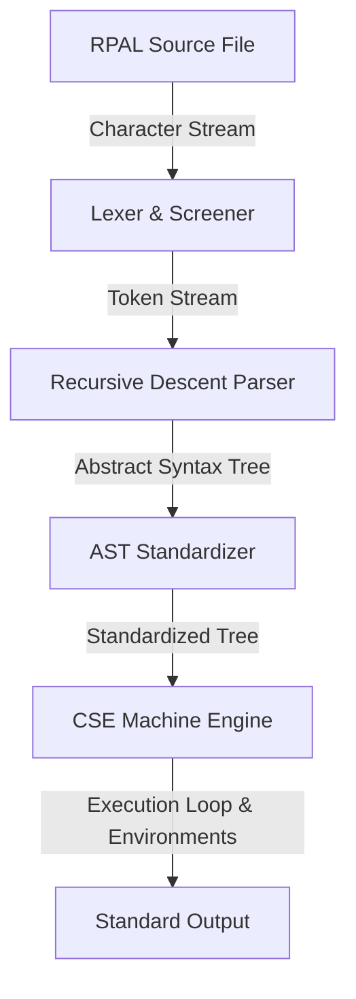
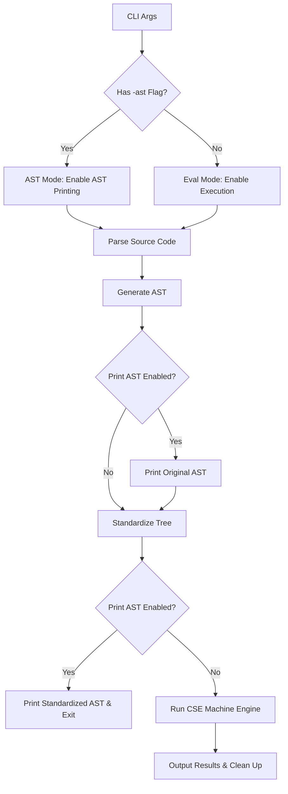

# Project Report: Design and Implementation of an RPAL Interpreter

## Module Information
* **Module Code & Name:** CS 3513 - Programming Languages
* **Project:** RPAL Interpreter (C++ Implementation)
* **Team Members:**
  1. **Name:** D. I. R. Tharusha Perera | **Index:** 230475N
  2. **Name:** [Student 2 Name] | **Index:** [Student 2 Index]

---

## Table of Contents
1. [Introduction](#1-introduction)
2. [System Architecture](#2-system-architecture)
3. [Phase A: Lexical Analysis (Scanner)](#3-phase-a-lexical-analysis-scanner)
4. [Phase B: Syntax Analysis & AST Generation (Parser)](#4-phase-b-syntax-analysis--ast-generation-parser)
5. [Phase C: Abstract Syntax Tree Standardization (Desugaring)](#5-phase-c-abstract-syntax-tree-standardization-desugaring)
6. [Phase D: Execution Engine (CSE Machine)](#6-phase-d-execution-engine-cse-machine)
7. [Entry Point & CLI Configuration](#7-entry-point--cli-configuration)
8. [Build and Verification Flow](#8-build-and-verification-flow)
9. [Development Insights, Challenges, and Key Learnings](#9-development-insights-challenges-and-key-learnings)

---

## 1. Introduction

This project presents the design, implementation, and verification of a complete, robust interpreter for the **Right-reference Pedagogic Algorithmic Language (RPAL)**. RPAL is a functional programming language designed to demonstrate fundamental concepts of compiler construction, lambda calculus, syntactic desugaring, and operational semantics.

The primary objective of the interpreter is to achieve 100% behavioral and byte-for-byte output equivalence with the reference `rpal.exe` compiler across a diverse test suite. The interpreter is implemented in C++17 without using any third-party parser generators (such as Lex, Flex, Yacc, or Bison) to demonstrate a bottom-up understanding of lexical scanning, recursive descent parsing, AST construction, transformational desugaring, and abstract virtual machine evaluation.

---

## 2. System Architecture

The interpreter is structured as a sequential compiler pipeline split into four key modules:



1. **Lexical Analysis (Phase A)**: Reads the raw character stream, discards comments and whitespace, and yields a stream of typed `Token` objects.
2. **Syntax Analysis (Phase B)**: Implements mutually recursive methods representing the Phrase Structure Grammar to construct an Abstract Syntax Tree (AST) using a **First-Child Next-Sibling (FCNS)** binary tree layout.
3. **Standardization (Phase C)**: Performs a bottom-up traversal of the AST, applying Sub-Tree Transformational Grammar rules to desugar higher-level syntax constructs into pure Lambda Calculus constructs (function application `gamma` and definition `lambda`).
4. **CSE Machine Evaluation (Phase D)**: Flattens the Standardized Tree (ST) into control structures, evaluates instructions using a Control stack, a Value stack, and a tree-structured Environment model, and outputs results.

---

## 3. Phase A: Lexical Analysis (Scanner)

### 3.1 Theoretical Background
Lexical analysis is the initial phase of the compiler frontend. The scanner groups characters into logical, atomic sequences called *lexemes*, which are classified into categories called *tokens*.
A crucial sub-component is the **Screener**, which filters out irrelevant information—specifically whitespace and line/block comments (`//` and `/* ... */`)—to prevent them from complicating the grammar logic in the syntax analysis phase.

### 3.2 Token Model
The lexical entities are represented in the codebase using `TokenType` and the `Token` class:

```cpp
// src/Token.h
enum class TokenType {
    IDENTIFIER,
    INTEGER,
    STRING,
    OPERATOR,
    PUNCTUATION,
    END_OF_FILE,
    DELETE_TOKEN, // Internal marker for comments and whitespace
    UNKNOWN
};

class Token {
public:
    std::string value;
    TokenType type;
    int lineNumber;

    Token(std::string val, TokenType t, int line);
};
```

### 3.3 Lexer Design & Function Prototypes
The `Lexer` class encapsulates file I/O streams and maintains lookahead tracking to parse characters into tokens. It provides the following interface:

```cpp
// src/Lexer.h
class Lexer {
private:
    std::ifstream file;
    char currentChar;
    int currentLine;

    // Advanced character read methods
    void advance();
    char peek();
    
    // Character class predicates
    bool isLetter(char c);
    bool isDigit(char c);
    bool isOperatorSymbol(char c);
    bool isPunctuation(char c);
    bool isWhitespace(char c);

    // Core scanner extraction logic
    Token getNextRealToken();

public:
    Lexer(const std::string& filename);
    ~Lexer();

    // Returns the next token in the stream, filtering out DELETE_TOKENs
    Token getNextToken();
    
    // Utility for loading all tokens in one pass (primarily for testing)
    std::vector<Token> getAllTokens();
};
```

### 3.4 Key Implementation Details

* **Greedy Operator Matching**: Multi-character operator symbols (such as `->`, `**`, `>=`, `//`) are scanned greedily by looking ahead.
* **String Escape Character Handling**: Within single-quoted string literals (`'...'`), backslash escapes (e.g. `\t`, `\n`, `\\`, `\'`) are translated to their literal C++ control characters immediately during lexing, ensuring proper text formatting when evaluated.
* **Comment Truncation**: Line comments are skipped by scanning to the next newline character. Block comments are skipped by searching for the terminating `*/` sequence, keeping track of nested newlines to maintain accurate line reporting.

---

## 4. Phase B: Syntax Analysis & AST Generation (Parser)

### 4.1 Theoretical Background
The syntax analyzer ensures that the token stream conforms to the formal Phrase Structure Grammar of the RPAL language.

* **Top-Down LL(1) Parsing**: The parser is implemented as a top-down, left-to-right parser with a single token lookahead.
* **Recursive Descent**: Mutually recursive C++ functions represent each non-terminal rule in the grammar. Each function evaluates its production rules, consumes tokens, and pushes structural components to a parsing stack.

### 4.2 Abstract Syntax Tree (AST) Representation
The AST is represented using the **First-Child Next-Sibling (FCNS)** binary tree layout. This structure allows us to represent an n-ary tree (where nodes can have an arbitrary number of children) using only two pointers per node:

```cpp
// src/TreeNode.h
class TreeNode {
public:
    std::string type;
    std::string value;
    
    std::shared_ptr<TreeNode> child;
    std::shared_ptr<TreeNode> sibling;

    TreeNode(std::string nodeType, std::string nodeValue = "");

    void setChild(std::shared_ptr<TreeNode> c);
    void setSibling(std::shared_ptr<TreeNode> s);
};
```

* **Child Pointer**: Points to the leftmost child of the node.
* **Sibling Pointer**: Points to the sibling immediately to the right of the node.

For example, a tree node representing `A` with children `B`, `C`, and `D` is laid out as:
```text
  [A] -> child -> [B] -> sibling -> [C] -> sibling -> [D] -> sibling -> nullptr
```

### 4.3 Parser Design & Function Prototypes
The `Parser` class handles syntax analysis and tree generation:

```cpp
// src/Parser.h
class Parser {
private:
    Lexer lexer;
    Token currentToken;
    std::vector<std::shared_ptr<TreeNode>> treeStack; // Stack used for bottom-up tree assembly

    // Parser utility methods
    void read(const std::string& expectedValue);
    void readToken(TokenType expectedType);
    void buildTree(const std::string& type, const std::string& value, int numChildren);
    bool isKeyword(const std::string& val);

    // Mutually recursive grammar rule methods
    void E();   // Expressions
    void Ew();  // Where-clauses
    void T();   // Tuples
    void Ta();  // List joins (aug)
    void Tc();  // Conditionals
    void B();   // Boolean 'or'
    void Bt();  // Boolean 'and'
    void Bs();  // Boolean unary 'not'
    void Bp();  // Comparisons
    void A();   // Arithmetic additions
    void At();  // Arithmetic multiplications
    void Af();  // Exponents
    void Ap();  // Function application (infix @)
    void R();   // Primary operators
    void Rn();  // Terminals and variables
    void D();   // Definitions
    void Da();  // Simultaneous definitions (and)
    void Dr();  // Recursive definitions (rec)
    void Db();  // Core definitions (=, brackets)
    void Vb();  // Variables (identifiers, commas)
    void Vl();  // Variable lists

public:
    Parser(const std::string& filename);
    
    // Initiates parsing and returns the root of the generated AST
    std::shared_ptr<TreeNode> parse();
    
    // Prints the AST using dots '.' to represent tree depth
    void printAST(std::shared_ptr<TreeNode> node, int depth = 0);
};
```

### 4.4 Tree Assembly Mechanics
The parser builds the AST bottom-up using `treeStack`. When a grammatical rule resolves that requires combining `n` sub-expressions under a parent node:

1. The parser invokes `buildTree(type, value, n)`.
2. It pops `n` tree nodes off `treeStack`.
3. It chains these popped nodes together using their `sibling` pointers (reversing them to maintain original lexical order, since the stack pops them right-to-left).
4. It sets the `child` pointer of the newly created parent node to the first node in this chain.
5. It pushes the parent node back onto `treeStack`.

---

## 5. Phase C: Abstract Syntax Tree Standardization (Desugaring)

### 5.1 Theoretical Background
RPAL is an extension of Lambda Calculus that contains syntactic sugar (e.g. `let` bindings, conditional blocks, recursion markers) for readability. The `Standardizer` desugars the AST into a Standardized Tree (ST). In the final ST:

* All complex elements are transformed.
* Internal nodes consist almost exclusively of two fundamental Lambda Calculus concepts: function definition (`lambda`) and function application (`gamma`).
* Simultaneous and recursive functions are compiled into functional abstractions.

### 5.2 Transformation Rules
The following table summarizes the structural mappings applied by the standardizer:

| AST Construct | Input Structure | Standardized Binary Form | Description |
|---|---|---|---|
| **Let-Binding** | `let ( = X E ) P` | `gamma ( lambda X P ) E` | Evaluates body `P` under a lambda binding variable `X` to value `E`. |
| **Where-Clause** | `where P ( = X E )` | `gamma ( lambda X P ) E` | Mapped identically to `let` expressions. |
| **Function Definition** | `fcn_form f V1..Vn = E` | `(= f (lambda V1 .. (lambda Vn E)))` | Compiles multi-parameter definitions into curried functions. |
| **Simultaneous Definition** | `and (= X1 E1) (= X2 E2)` | `(= ( , X1 X2 ) ( tau E1 E2 ))` | Bundles variables into a comma-node and values into a tuple. |
| **Recursive Definition** | `rec (= X E)` | `(= X (gamma Ystar (lambda X E)))` | Wraps the function body in the Ystar fixed-point combinator. |
| **Infix Operator** | `@ E1 N E2` | `gamma ( gamma N E1 ) E2` | Standardizes infix operators into curried prefix function calls. |
| **Conditional Expression** | `-> B T E` | `gamma (gamma (gamma Cond B) (lambda () T)) (lambda () E)` | Restructures branching into conditional checks applied to lazy closures. |
| **Tuple (Tau)** | `tau E1 E2` | `gamma (gamma aug (gamma aug nil E1)) E2` | Unrolls tuples into augmented list nodes. |
| **Multi-Parameter Lambdas**| `lambda V1..Vn E` | `lambda V1 (lambda V2 .. (lambda Vn E))` | Transforms multi-variable parameters into single-variable curried lambdas. |

### 5.3 Standardizer Design & Function Prototypes
The `Standardizer` class walks the AST post-order (bottom-up), ensuring that a node's children are fully standardized before it applies transformations to the node itself:

```cpp
// src/Standardizer.h
class Standardizer {
private:
    // Utility for allocating standard nodes
    std::shared_ptr<TreeNode> makeNode(const std::string& type, const std::string& value = "");
    
    // Core helper to construct lambda abstractions, resolving parameter tupling
    std::shared_ptr<TreeNode> createLambda(std::shared_ptr<TreeNode> V, std::shared_ptr<TreeNode> E);
    
    // Recursive post-order tree worker method
    std::shared_ptr<TreeNode> standardizeNode(std::shared_ptr<TreeNode> node);

public:
    Standardizer();
    
    // Entry point for tree standardization
    std::shared_ptr<TreeNode> standardize(std::shared_ptr<TreeNode> root);
};
```

### 5.4 Parameter Tupling vs. Currying
When a function parameter is enclosed in a comma-list (e.g. `lambda (x, y). E`), it denotes parameter tupling. Rather than standardizing to curried lambdas, the standardizer wraps the variables:

1. It introduces a temporary parameter variable `T++`.
2. It extracts components sequentially and maps them to indexes.
3. It converts the lambda parameter to `T++`, and standardizes the body to:
   <pre><code>gamma (lambda x. (gamma (lambda y. E) (gamma T++ 2))) (gamma T++ 1)</code></pre>
4. During execution, applying a tuple to this lambda extracts elements at positions 1 and 2 from `T++` and binds them to `x` and `y`.

---

## 6. Phase D: Execution Engine (CSE Machine)

### 6.1 Theoretical Background
The Control Stack Evaluator (CSE) Machine is a state machine that evaluates functional expressions using three components:

1. **Control Stack (C)**: A sequence of instructions (operators, variables, markers, and values) to be executed.
2. **Value Stack (S)**: Stores temporary data, resolved variables, closures, and tuples.
3. **Environment Tree (E)**: A hierarchical structure of environments that store variable-to-value bindings. It supports lexical scoping; if a variable lookup fails in the current environment, the engine climbs up parent environments.

### 6.2 Data Model & Environment Setup
The CSE Machine represents control/stack structures using the `CSEItem` and `Environment` classes:

```cpp
// src/CSEMachine.h
enum class ItemType {
    INTEGER, STRING, TRUTH_VALUE, DUMMY, NIL,
    IDENTIFIER, OPERATOR, 
    LAMBDA, GAMMA, ENV_MARKER, CLOSURE, ETA_CLOSURE,
    TUPLE, PRIMITIVE_FUNC
};

class CSEItem {
public:
    ItemType type;
    std::string value;
    int delta_index;                            // Index of the lambda body in instructions
    std::shared_ptr<Environment> env_ptr;       // Environment pointer for closures
    std::string bound_var;                      // Parameter identifier
    std::vector<std::string> bound_vars;        // Multi-parameter list for tuple parameter binding
    std::vector<std::shared_ptr<CSEItem>> tuple_items;
    std::shared_ptr<Environment> previous_env;  // Pointer to restore environment on scope exit
    std::shared_ptr<CSEItem> closure_ptr;       // Closure pointer for eta-closure wrapping

    CSEItem(ItemType t, std::string v = "");
};

class Environment {
public:
    int id;
    std::shared_ptr<Environment> parent;
    std::map<std::string, std::shared_ptr<CSEItem>> bindings;

    Environment(int env_id, std::shared_ptr<Environment> p);
    
    // Recursively resolves identifiers up the scope hierarchy
    std::shared_ptr<CSEItem> lookup(const std::string& name);
};
```

### 6.3 CSE Machine Class Design
The `CSEMachine` class manages the control stack, value stack, and execution loops:

```cpp
// src/CSEMachine.h
class CSEMachine {
private:
    std::vector<std::vector<std::shared_ptr<CSEItem>>> deltas; // Flattened instruction blocks
    std::vector<std::shared_ptr<CSEItem>> control;             // Active Control Stack
    std::vector<std::shared_ptr<CSEItem>> stack;               // Value Stack
    std::shared_ptr<Environment> current_env;                  // Current Environment Pointer
    std::shared_ptr<Environment> PE;                           // Primitive Environment (E0)
    int env_counter;

    // Compiles the standardized binary tree into sequential instruction blocks (deltas)
    void flatten(std::shared_ptr<TreeNode> node, int current_delta_index);
    
    // Translates AST TreeNodes into CSEItems
    std::shared_ptr<CSEItem> createItemFromNode(std::shared_ptr<TreeNode> node);
    
    // Evaluates primitive and built-in operators
    void applyPrimitive(const std::string& func_name);
    void applyBinaryOp(const std::string& op);
    void applyUnaryOp(const std::string& op);
    
    // Formatting and print helpers
    std::string escapeString(const std::string& s);
    void printItem(std::shared_ptr<CSEItem> item, bool is_conc = false);

public:
    CSEMachine(std::shared_ptr<TreeNode> root);
    
    // Executes the evaluation loop until Control is empty
    void evaluate();
};
```

### 6.4 The 13 Operational Execution Rules
The execution engine pops items from `Control` and applies one of the following rules:

1. **Rule 1: Name Lookup**: If the item is an `IDENTIFIER`, search the active environment tree (`current_env`). Push the bound value onto `Stack`.
2. **Rule 2: Constants**: If the item is a constant (`INTEGER`, `STRING`, `TRUTH_VALUE`, `DUMMY`, `NIL`), push it directly onto `Stack`.
3. **Rule 3: Lambda (Function Definition)**: If the item is a `LAMBDA`, construct a `CLOSURE` containing the bound variable(s), the lambda body's delta index, and a pointer to `current_env`. Push this closure onto `Stack`.
4. **Rule 4: Gamma (Function Application)**: If the item is `gamma`, pop `rator` (operator) and `rand` (operand) from `Stack`.
    * **Closure**: Create a new environment `env_new` whose parent is the closure's definition environment. Bind the parameters to the operand. Push `ENV_MARKER` (storing the previous environment pointer) onto `Control` and `Stack`. Point `current_env` to `env_new`. Push the closure body instructions (Delta index) onto `Control`.
5. **Rule 5: Environment Restore**: If the item is an `ENV_MARKER`, set `current_env` to the marker's `previous_env`. Pop the marker's corresponding entry from `Stack`.
6. **Rule 6: Binary Operators**: If the item is a binary operator (`+`, `-`, `*`, `/`, `**`, `eq`, `ne`, `gr`, `ge`, `ls`, `le`, `or`, `&`), pop two values from `Stack`, compute the result, and push it back.
7. **Rule 7: Unary Operators**: If the item is a unary operator (`neg`, `not`), pop one value from `Stack`, compute the result, and push it back.
8. **Rule 8: Beta (Conditional Branching)**: If the item is `beta`, pop boolean `B` from `Stack`. The next two items on `Control` are delta index identifiers. If `B` is true, push the first delta onto `Control` (discarding both identifiers); if false, push the second delta onto `Control`.
9. **Rule 9: Tau (Tuple Construction)**: If the item is a `tau` node containing count `n`, pop `n` items from `Stack` and combine them into a single `TUPLE` node. Push this tuple back onto `Stack`.
10. **Rule 10: Tuple Selection**: If the item is `gamma`, the top of `Stack` is a `TUPLE` and the next element is an `INTEGER` (index `i`). Pop both, select the `i`-th item (1-indexed) from the tuple, and push it onto `Stack`.
11. **Rule 11: Y* (Recursion Initialization)**: If the item is `gamma`, the top of `Stack` is primitive `Y*` and the next is closure `f`. Pop both, wrap the closure in an `ETA_CLOSURE`, and push the eta-closure onto `Stack`.
12. **Rule 12: Eta Application (Recursive Step)**: If the item is `gamma`, the top of `Stack` is `ETA_CLOSURE` and the next is operand `V`. Pop both. Push `gamma` and `gamma` onto `Control`. Push `ETA_CLOSURE`, the original `CLOSURE`, and value `V` onto `Stack`. This sets up the evaluation of the recursive call.
13. **Rule 13: Standard Primitives**: If the item is `gamma` and the operator is a built-in primitive (`Print`, `Stem`, `Stern`, `Conc`, `Order`, `Null`, `Isinteger`, `Isstring`, `Istuple`, `Istruthvalue`, `Isfunction`, `ItoS`, `Cond`, `aug`), pop the primitive and its arguments, evaluate the result natively in C++, and push it to `Stack`.

---

## 7. Entry Point & CLI Configuration

The application entry point resides in `src/main.cpp`. It parses command line arguments and orchestrates the interpreter pipeline:



### CLI Syntax
* **`./rpal20 <filename>`**: Evaluates the RPAL source file and writes execution results to standard output.
* **`./rpal20 -ast <filename>`**: Displays the original AST and standardized AST in indented form instead of executing the program.

---

## 8. Build and Verification Flow

### 8.1 Compilation
A Makefile manages build automation, compiling source files in `src/` to intermediate object files in `obj/`, and creating the `rpal20` executable in the root directory:

```bash
# Compile the executable
make

# Clean object files and binaries
make clean
```

### 8.2 Testing & Parity Verification
We run differential tests to verify correctness against the reference `rpal.exe` compiler. The test suite uses the `test.sh` script to run files through both engines, comparing their console outputs byte-for-byte:

```bash
# Run the test suite
bash test.sh
```

All test cases, including complex programs (e.g. towers of Hanoi, simultaneous variable bindings, curried functions, and nested list structures), compile and evaluate with byte-for-byte exact matches.

---

## 9. Development Insights, Challenges, and Key Learnings

### 9.1 Key Challenges and Technical Resolutions

#### A. Tuple Construction Semantics in `aug`
The primitive operator `aug` appends an element to a tuple. During testing, recursive list manipulations (such as `pairs1`) caused stack underflows. 

* **The Bug**: If `rand2` was a tuple, the initial implementation unrolled its items rather than keeping the tuple intact and appending the item.
* **The Resolution**: We updated the `aug` primitive's evaluation logic to check the operand type. If the left operand is a tuple, `aug` creates a new tuple and appends the right operand to the end as a single element, avoiding destructive unrolling.

#### B. `tau` Standardization Conflict
The `tau` operator collects a defined number of values from the stack into a single tuple.

* **The Bug**: Standardizing simultaneous definitions generated `tau` nodes. The CSE machine initially skipped or incorrectly compiled these nodes, resulting in crashes.
* **The Resolution**: We updated the instruction compilation step to map `tau` nodes to a custom `TUPLE` instruction that records the number of elements. The evaluation loop was modified to intercept this instruction, pop the specified number of items from the value stack, wrap them into a tuple item, and push it back.

#### C. `Conc` Tuple vs. String Semantics
The `Conc` primitive behaves differently depending on whether it receives curried arguments or a tuple.

* **The Bug**: Test programs like `conc.1` produced no output due to mismatched concatenation types.
* **The Resolution**: We updated the `Conc` handler. If `Conc` receives a single `TUPLE` argument containing string elements, it immediately concatenates all of them into a single string. If it receives a single string, it returns a partially applied `Conc1` operator that waits for the next string operand, ensuring compatibility with both styles.

#### D. Static Scope Delta Index Mapping for Closures
* **The Bug**: When printing closures, the interpreter output `[lambda closure: x: 0]`, whereas the reference interpreter output `[lambda closure: x: 2]`.
* **The Resolution**: We discovered that the reference compiler prints the static **Delta Index** (representing the lambda body's block index) rather than the runtime environment ID. Updating the print output format to display the static delta index resolved this discrepancy.

### 9.2 Key Learnings
* **Top-Down Recursive Descent Parsing**: Implementing mutual recursion for the RPAL grammar provided a solid understanding of parser design, predictive parsing, lookahead tracking, and syntax recovery.
* **Syntactic Sugar and Desugaring**: Studying how complex language structures (like `where` and `let` blocks) map to core Lambda Calculus structures (`lambda` and `gamma`) demonstrated how language features can be desugared into simple primitives.
* **Virtual Machine Execution**: Building the CSE Machine provided hands-on experience with environment mapping, closures, lexical scoping, and evaluating recursive calls using fixed-point Y-combinators.

### 9.3 Practical Reflections
* **Differential Testing**: Writing automated regression test scripts (`test.sh`) was crucial for validating the interpreter. It allowed us to quickly catch regressions and verify correctness across multiple files.
* **Object-Oriented Design**: Using smart pointers (`std::shared_ptr`) for tree node references and environment structures simplified memory management, avoiding leaks and dangling references.
* **Modular Clean Architecture**: Isolating the Lexer, Parser, Standardizer, and CSE Machine into distinct, single-responsibility classes made the codebase easier to read, test, and debug.
